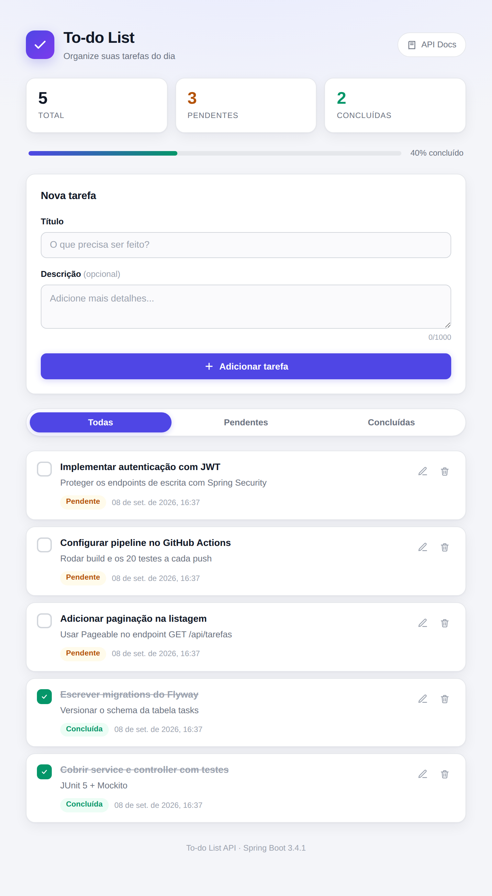
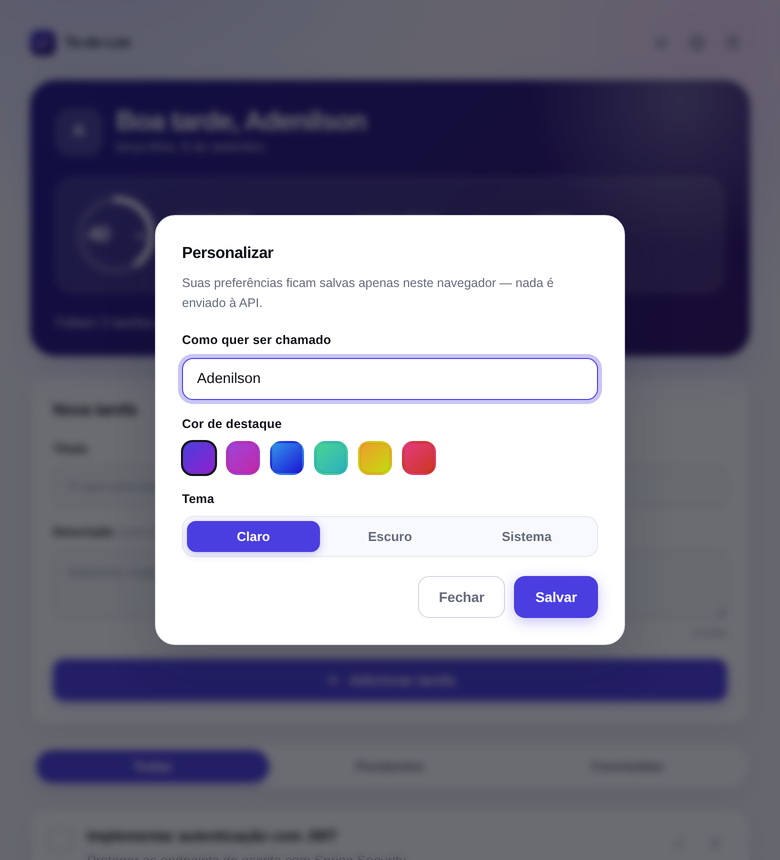
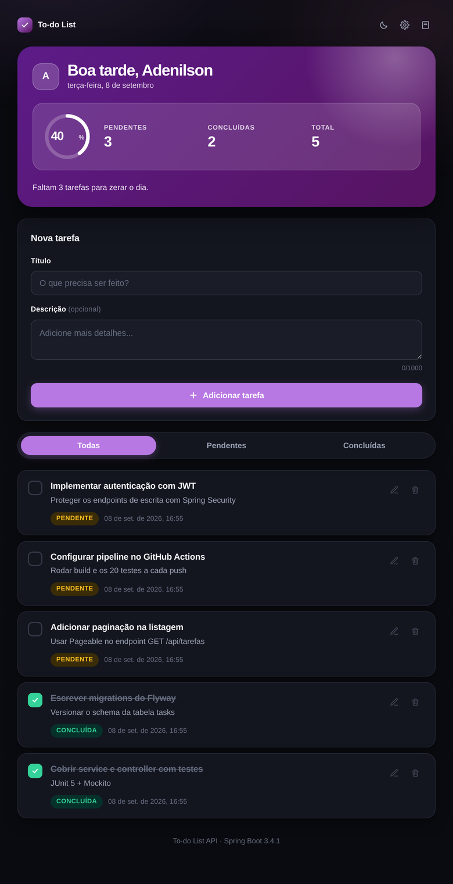

<div align="center">

# To-do List

**API REST de gerenciamento de tarefas com interface web integrada.**

[](https://openjdk.org/)
[](https://spring.io/projects/spring-boot)
[](https://www.mysql.com/)
[](https://flywaydb.org/)
[](https://swagger.io/)
[](#executar-testes)



</div>

---

## Sobre

Aplicação Spring Boot que expõe um CRUD de tarefas por uma API REST documentada com OpenAPI e
acompanha uma **interface web pronta para uso**, servida pela própria aplicação em
`http://localhost:8080` — sem build de frontend, sem dependência externa.

| | |
|---|---|
| **Interface web** | Criar, concluir, editar, excluir e filtrar tarefas, com anel de progresso e resumo do dia |
| **Personalização** | Saudação com o seu nome, seis cores de destaque e tema claro/escuro/sistema |
| **API REST** | Cinco endpoints em `/api/tarefas`, com validação de entrada e erros padronizados |
| **Documentação** | Swagger UI com exemplos, descrições de campo e schemas de erro |
| **Banco** | MySQL em produção e H2 em memória nos testes, com schema versionado pelo Flyway |

## Tecnologias

- **Java 17**
- **Spring Boot 3.4.1** (Web, Data JPA, Validation)
- **MySQL 8** (produção) / **H2** (testes)
- **Flyway** (migração de banco)
- **SpringDoc OpenAPI / Swagger** (documentação)
- **JUnit 5 + Mockito** (testes)
- **Maven 3.9.9**
- **HTML, CSS e JavaScript puro** (interface web, sem framework nem build)

## Pré-requisitos

- **Java 17+** instalado
- **MySQL 8** instalado e rodando
- **Maven 3.8+** (ou use o Maven Wrapper incluso na pasta `maven/`)

## Configuração do Banco

1. Acesse o MySQL e crie o banco de dados:

```sql
CREATE DATABASE todolist;
```

2. A conexão é configurada por variáveis de ambiente, com valores padrão para
desenvolvimento local (`root`/`root` em `localhost:3306`). Para usar outras credenciais,
copie o modelo e ajuste:

```bash
cp .env.example .env
```

| Variável | Padrão |
|----------|--------|
| `DB_URL` | `jdbc:mysql://localhost:3306/todolist?...` |
| `DB_USERNAME` | `root` |
| `DB_PASSWORD` | `root` |
| `SERVER_PORT` | `8080` |

O `.env` é ignorado pelo Git. Nenhuma credencial precisa ser editada dentro do
`application.yml`, o que permite publicar a aplicação sem alterar o código.

## Como Executar

### Com Maven local

```bash
# Na raiz do projeto
mvn spring-boot:run
```

### Com o Maven empacotado (sem Maven global)

```bash
# Na raiz do projeto
./maven/bin/mvn spring-boot:run
```

### Gerar JAR e executar

```bash
./maven/bin/mvn package -DskipTests
java -jar target/to-do-list-1.0.0.jar
```

Com a aplicação no ar:

| Endereço | O que é |
|----------|---------|
| http://localhost:8080 | Interface web |
| http://localhost:8080/swagger-ui.html | Swagger UI |
| http://localhost:8080/api-docs | Especificação OpenAPI (JSON) |

## Interface Web

Os arquivos ficam em `src/main/resources/static/` e são servidos automaticamente pelo Spring Boot:
não há passo de build, instalação de pacotes nem servidor separado. A página consome os mesmos
endpoints REST documentados abaixo e traz:

- Saudação que muda com o horário e o nome configurado, com a data do dia
- Anel de progresso e resumo contextual ("faltam 3 tarefas para zerar o dia")
- Formulário de criação com validação e contador de caracteres
- Lista com conclusão em um clique, edição em modal e exclusão com confirmação
- Filtros por situação, com indicador deslizante
- Mensagens de erro vindas da API exibidas na tela
- Layout responsivo e animações que respeitam `prefers-reduced-motion`

### Personalização

<div align="center">

</div>

O painel de personalização define **nome**, **cor de destaque** (seis opções) e **tema**
(claro, escuro ou seguindo o sistema). Toda a paleta da interface deriva de dois valores —
`--accent-h` e `--accent-s` — então trocar a cor repinta o hero, os botões, os filtros e os
estados de foco de uma vez só.

As preferências ficam em `localStorage`: valem só naquele navegador e nunca são enviadas à API.
São aplicadas por `js/prefs.js`, carregado de forma síncrona no `<head>` justamente para que o
tema esteja definido antes da primeira pintura — sem piscar a tela no tema errado.

O contraste do texto sobre o hero foi medido nas seis cores e nos dois temas: o pior caso fica
em **4,68:1**, acima do mínimo de 4,5:1 exigido pelo WCAG AA.

<div align="center">

</div>

## Endpoints da API

| Método | Rota | Descrição |
|--------|------|-----------|
| `POST` | `/api/tarefas` | Criar uma nova tarefa |
| `GET` | `/api/tarefas` | Listar todas as tarefas |
| `GET` | `/api/tarefas/{id}` | Buscar tarefa por ID |
| `PUT` | `/api/tarefas/{id}` | Atualizar uma tarefa |
| `DELETE` | `/api/tarefas/{id}` | Deletar uma tarefa |

### Exemplos de Requisição

**Criar tarefa** (`POST /api/tarefas`):

```json
{
  "titulo": "Estudar Spring Boot",
  "descricao": "Aprofundar em JPA e Flyway",
  "concluida": false
}
```

**Atualizar tarefa** (`PUT /api/tarefas/1`):

```json
{
  "titulo": "Estudar Spring Boot Avançado",
  "descricao": "Segurança com Spring Security",
  "concluida": true
}
```

### Respostas

**201 Created** (POST):

```json
{
  "id": 1,
  "titulo": "Estudar Spring Boot",
  "descricao": "Aprofundar em JPA e Flyway",
  "concluida": false,
  "dataCriacao": "2026-06-26T10:00:00",
  "dataAtualizacao": "2026-06-26T10:00:00"
}
```

**400 Bad Request** (validação):

```json
{
  "status": 400,
  "mensagem": "Erro de validação",
  "timestamp": "2026-06-26T10:00:00",
  "erros": ["titulo: O título é obrigatório"]
}
```

**404 Not Found**:

```json
{
  "status": 404,
  "mensagem": "Tarefa com id 99 não encontrado(a)",
  "timestamp": "2026-06-26T10:00:00",
  "erros": []
}
```

## Documentação Swagger

Com a aplicação rodando, acesse:

- **Swagger UI:** http://localhost:8080/swagger-ui.html
- **OpenAPI JSON:** http://localhost:8080/api-docs

Cada campo dos DTOs traz descrição e exemplo, e as respostas de erro apontam para o schema
`ErrorResponse`, então dá para testar os endpoints direto pelo navegador.

## Executar Testes

```bash
./maven/bin/mvn test
```

Os testes usam banco H2 em memória (não é necessário MySQL rodando). O projeto possui **26 testes**
cobrindo:

- **TaskService:** criação, listagem, busca por ID, atualização e exclusão
- **TaskController:** validação de status HTTP, corpo de resposta e tratamento de erros
- **SchemaMigrationTest:** as migrations do Flyway aplicam-se sem erro e produzem as colunas
  que a entidade `Task` espera
- **TaskRepositoryTest:** persistência real contra o schema criado pelo Flyway

As duas últimas classes existem porque as demais não tocam no banco: `TaskService` é testado
com mocks e `TaskController` numa fatia `@WebMvcTest`, que não carrega DataSource nem Flyway.
O perfil de teste usa `ddl-auto: validate`, então o Hibernate confere as entidades contra o
schema das migrations — uma migration quebrada, ou um campo sem migration correspondente,
derruba o build.

## Estrutura do Projeto

```
src/
├── main/
│   ├── java/com/todolist/
│   │   ├── config/          # Configurações (Swagger/OpenAPI)
│   │   ├── controller/      # Endpoints REST
│   │   ├── dto/             # Objetos de requisição/resposta
│   │   ├── entity/          # Entidade JPA
│   │   ├── exception/       # Tratamento global de erros
│   │   ├── repository/      # Camada de dados
│   │   └── service/         # Lógica de negócio
│   └── resources/
│       ├── db/migration/    # Migrações Flyway
│       ├── static/          # Interface web
│       │   ├── css/         #   estilos (tema e cor dinâmicos)
│       │   ├── js/          #   prefs.js (preferências) e app.js (cliente da API)
│       │   └── index.html
│       └── application.yml  # Configurações da aplicação
└── test/
    └── java/com/todolist/
        ├── controller/      # Testes do controller (MockMvc)
        ├── db/              # Migrations e persistência (Flyway + JPA)
        └── service/         # Testes do service (Mockito)
```
